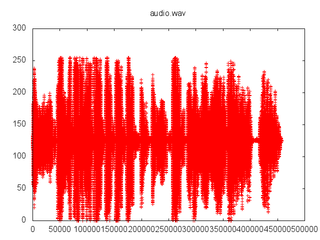

AudioParser can load a WAV audio file, show some of it's metadata, and export the digital audio data to a text file. The values of the text file can be graphed to show the waveform of the audio.

This program is more or less just an exploration into audio files. For simplicty it only takes uncompressed WAV files for now (currently working on AIFF). There is a sample WAV file included to test the program on. You can also input your own data file.

The C source code, compiled executable, and a sample WAV file are included. To run the program on OS X or other UNIX system, the directory must first be changed in Terminal to the location of the WAV file (cd /Users/YOUR_USER_NAME/Downloads/AudioParser-master). After, enter the the file directory of the executable (/Users/YOUR_USER_NAME/Downloads/AudioParser-master/AudioParser) or drag the executable into the Terminal window.

In an effort to conserve memory, there is an audio file size max limit of 500 kb. This can be changed by changing the 'MAX_FILE_SIZE_IN_BYTES' macro (the current limit is reasonable for the sample WAV file).

A graphing library is not used to graph the waveform. To see the waveform graph of the audio data you can import the text file into a graphing software, such as MATLAB or gnuplot. Gnuplot is really easy to use and can easily be installed via Homebrew for OS X (http://brew.sh/). Within gnuplot, set the Teminal to an image type (png) and set the output image path for an image of the audio waveform.

Gnuplot waveform graph of audio.wav:

(Graph accuracy checked against the audio waveform in Audacity)